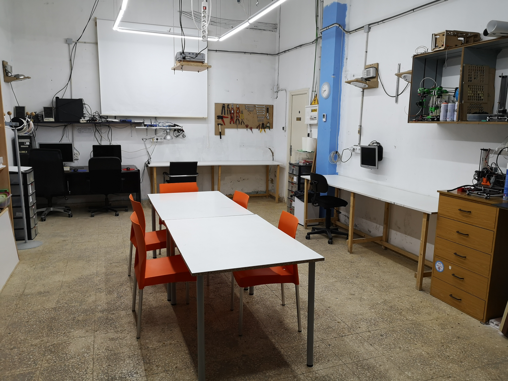
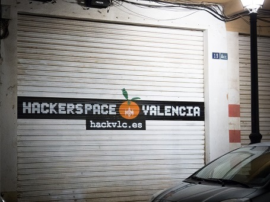
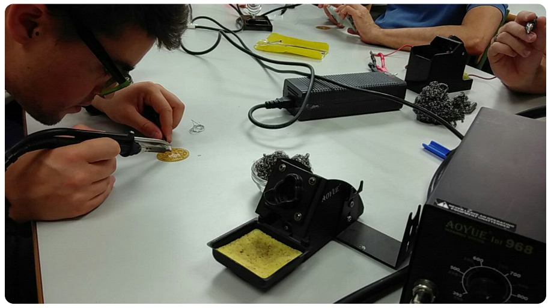
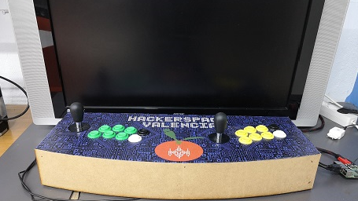
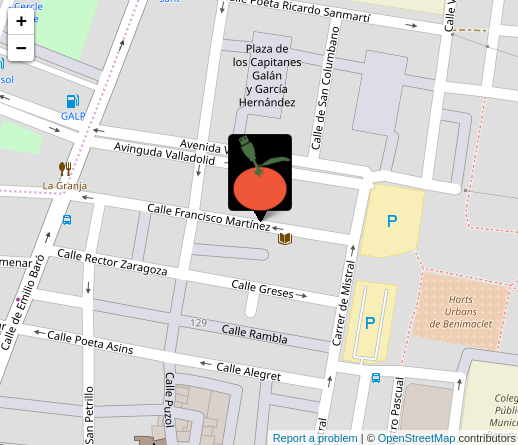

# Hackerspace Valencia

Los [Hackerspace](http://hackerspaces.org/) son un espacio común donde todo tipo de gente se reúne, comparte su interés en la tecnología y colabora en proyectos para aprender unos de otros.

# Nuestra Asociación

HackerspaceVLC es un espacio Maker que promueve el uso de las tecnologías libres. Es un espacio abierto a todas las personas que tengan interés por aprender y compartir la tecnología, aprender a utilizarla, modificarla y reaprovecharla a nuestro gusto. Queremos poner la tecnología al servicio de las personas, aprovechándola más allá de lo que los fabricantes y corporaciones decidieron al crearla. Dándole una segunda vida a aquellos aparatos que ya no utilizamos, evitando crear nuevos deshechos y poniéndolos en manos de otras personas que sí los van a aprovechar.

No es necesario que tengas conocimientos sobre informática o electrónica, en el HackerspaceVLC encaja toda persona que tenga interés por aprender y pasarlo bien es bienvenida.

# Local y actividades

Disponemos de un local en el barrio de Benimaclet donde los socios y socias pueden reunirse y poner en marcha sus proyectos, con equipamiento, espacio de almacenaje y espacios de trabajo.

Además, realizamos talleres y charlas abiertas a todo el público, sobre múltiples temas que despiertan interés en la comunidad (Arduino, Impresión 3D, FPGAs, IoT, LoRaWAN/TTN, Restauración de radios de válvulas, soldadura SMD, FreeCad, KiCad, Administración de sistemas...).

Puedes consultar nuestras actividades en [Meetup](https://www.meetup.com/es-ES/Hackerspace-Valencia/events/)

|||
|||

# Quiero unirme

Al unirte a HackerspaceVLC pasarás a ser un miembro más de la asociación con pleno derecho a utilizar nuestras instalaciones y equipamiento, como equipos de soldadura, electrónica, ordenadores, etc... además de conocer a otras personas que dominan disciplinas que tú desconoces, por lo que el aprendizaje está garantizado. Para asociarte tan solo deberás venir una de las jornadas de puertas abiertas y podrás unirte en el mismo día.

Para asociarte necesitarás venir y rellenar el [Formulario de alta](FormularioAltaHackerspace_V2.0.pdf) del HackerspaceVLC y en función de tu situación laboral, se te cobrará por el banco a principios de mes la cuota mensual que te corresponda.

# Cuotas

| Situación | Cuota |
|-----------|-------|
| En activo | **25€** / mes |
| Estudiante, desempleado o jubilado | **10€** / mes |

# Contacto

Hackerspace Valencia
Calle Francisco Martínez, 19, Bajo
CP 46020, Valencia (Benimaclet)
España

### Correo oficial

[hackerspacevlc@gmail.com](mailto:hackerspacevlc@gmail.com)

### Horario oficial de apertura

* Todos los martes no festivos, de **17:30** a **20:30**.
* Para otros días no-oficiales, consultar los eventos programados.

### Cómo llegar

* **Metro:** Líneas 3,9: Machado y Benimaclet.
* **Tranvía:** Líneas 4,6: Benimaclet.
* **Autobús:** Líneas 70,12 (parada Emili Baró - Francesc Martínez), 10 (parada Lliri Blau-Mestre Bonaventura Pascual).

[Ampliar el mapa](https://www.openstreetmap.org/?mlat=39.48828&mlon=-0.35839#map=19/39.48828/-0.35839&layers=N)

# Meetup

<iframe width="700" height="1000" src="https://www.meetup.com/es-ES/Hackerspace-Valencia/" frameborder="0"></iframe>
