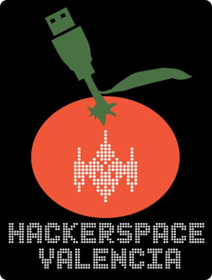

# ¿Qué es un Hackerspace?

Los [Hackerspace](http://hackerspaces.org/) son un espacio común donde todo tipo de gente se reúne, comparte su interés en la tecnología y colabora en proyectos para aprender unos de otros.

# Nuestra Asociación

HackerspaceVLC es un espacio abierto a todos y a todas las personas que tengan interés por aprender y compartir la tecnología, aprender a utilizarla, modificarla y reaprovecharla a nuestro gusto. Queremos poner la tecnología al servicio de las personas, aprovechándola más allá de lo que los fabricantes y corporaciones decidieron al crearla. Dándole una segunda vida a aquellos aparatos que ya no utilizamos, evitando crear nuevos deshechos y poniéndolos en manos de otras personas que sí los van a aprovechar.

No es necesario que tengas conocimientos sobre informática o electrónica, en el HackerspaceVLC encaja toda persona que tenga interés por aprender y pasarlo bien es bienvenida.

# Quiero unirme

Al unirte a HackerspaceVLC pasarás a ser un miembro más de la asociación con pleno derecho a utilizar nuestras instalaciones y equipamiento, como equipos de soldadura, electrónica, ordenadores, etc... Para asociarte tan solo deberás venir una de las jornadas de puertas abiertas y podrás unirte en el mismo día.

Para asociarte necesitarás traer tu DNI, aceptar el [régimen interno](DocumentoRegimenInterno.pdf) del HackerspaceVLC y en función de tu situación, abonar durante los 5 primeros días de cada mes la cuota mensual que te corresponda por transferencia bancaria al número de cuenta que se te facilitará en el momento de la inscripción.

| Situación | Cuota |
|-----------|-------|
| Regular | **20€** / mes |
| Estudiante, desempleado o jubilado | **8€** / mes |

# Contacto

Hackerspace Valencia
Calle Francisco Martínez, 19, Bajo
CP 46020, Valencia (Benimaclet)
España

### Cómo llegar

* **Metro:** Líneas 3,9: Machado y Benimaclet.
* **Tranvía:** Líneas 4,6: Benimaclet.
* **Autobús:** Líneas 70,12 (parada Emili Baró - Francesc Martínez), 10 (parada Lliri Blau-Mestre Bonaventura Pascual).

### Horario oficial de apertura

* Todos los martes no festivos, de **17:30** a **20:30**.
* Para otros días no-oficiales, consultar los eventos programados.
